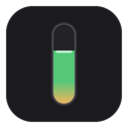
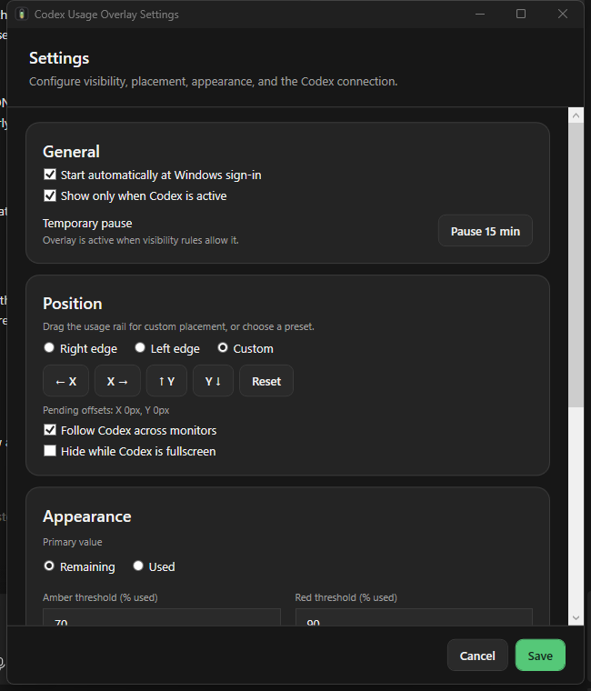

# Codex Usage Overlay

<p>
  
</p>

Codex Usage Overlay is an unofficial Windows companion that keeps your remaining Codex quota visible beside the desktop app. It runs as a separate process, uses the documented Codex App Server protocol, and never injects code into Codex.

> Preview release: Windows only. This project is not affiliated with or endorsed by OpenAI.

## Highlights

- Shows remaining quota as a slim vertical rail with a compact percentage label.
- Opens a detailed card with used percentage, reset time, and additional model limits.
- Updates from `account/rateLimits/read` and `account/rateLimits/updated`.
- Hides whenever Codex is minimized or another application is active.
- Supports drag-and-drop placement anywhere inside the Codex window.
- Restores saved placement across restarts, resizes, and monitor changes.
- Supports manual hide/show, 15-minute pause, fullscreen exclusion, and automatic startup.
- Includes a native dark Settings window for visibility, position, appearance, and connection controls.
- Provides a close button and Escape shortcut for pinned usage details without exiting the app.
- Uses a single running instance. Launching it again restores a hidden overlay.
- Stores no credentials and sends no telemetry.

The App Server methods used by this project are documented in the [official OpenAI Codex App Server documentation](https://learn.chatgpt.com/docs/app-server).

## Requirements

- Windows 10 or Windows 11, x64
- Codex CLI available on `PATH`
- Codex signed in with ChatGPT-backed authentication

The rate-limit endpoint requires authentication backed by Codex services. API-key-only and Bedrock authentication do not provide this account usage data.

## Install a release

1. Download the Windows zip from the repository's Releases page.
2. Extract it to a directory you control.
3. Run `CodexUsageOverlay.exe`.
4. Keep Codex active. The usage rail appears inside the Codex window.

Optional helper scripts in the release package can add Windows shortcuts:

```powershell
.\scripts\install-start-menu.ps1
.\scripts\install-startup.ps1
```

Use the matching `uninstall-*.ps1` scripts to remove only those shortcuts.

## Controls

- Hover the rail to open quota details.
- Click the rail to pin or unpin the detail card.
- Use the close button or press Escape to collapse pinned details without closing the overlay.
- Drag the rail and release it to save a custom position.
- Right-click the rail to hide, refresh, or exit.
- Select **Settings** from the rail or tray menu for General, Position, Appearance, and Advanced controls.
- Launch the application again to restore an already-running hidden instance.

Display settings include left and right presets, custom placement, position nudges, offset reset, and fullscreen hiding.

## Settings

The native Settings window uses explicit Save and Cancel controls. Safe display and appearance changes apply immediately; CLI path and refresh interval changes are saved for the next restart.



## Build from source

Install the [.NET 8 SDK](https://dotnet.microsoft.com/download/dotnet/8.0), then run:

```powershell
cd codex-usage-overlay
.\scripts\build.ps1
.\scripts\run.ps1
```

Run these commands from a local clone of the repository.

### Demo mode

Demo mode renders the interface without starting App Server:

```powershell
dotnet run --project .\src\CodexUsageOverlay\CodexUsageOverlay.csproj `
    --configuration Release -- --demo=75 --expanded
```

Try `--demo=25`, `--demo=75`, and `--demo=92` to inspect each usage state.

Open the Settings window directly for UI review:

```powershell
dotnet run --project .\src\CodexUsageOverlay\CodexUsageOverlay.csproj `
    --configuration Release -- --demo=75 --settings
```

### Tests

```powershell
.\scripts\build.ps1
```

This performs a release build with warnings treated as errors and runs the dependency-free specification suite.

The authenticated smoke test is optional and should run only on a machine already signed in to Codex:

```powershell
.\scripts\smoke-live.ps1
```

### Release package

Create the public Windows release zip and checksum:

```powershell
.\scripts\package-release.ps1
```

Generated files are written under `artifacts\release` and are excluded from Git.

## How it works

The overlay launches `codex app-server --stdio` and communicates through newline-delimited JSON-RPC. It requests current rate limits, listens for update notifications, and polls every 60 seconds as a fallback.

The window tracker identifies the active Microsoft Store Codex package by executable path. The overlay is a non-activating WPF tool window, so it does not take keyboard focus from Codex. See [Architecture](docs/architecture.md) for the component map and trust boundaries.

## Privacy and security

- No telemetry or analytics are collected.
- No conversation content is requested or read.
- No credentials, cookies, or Codex authentication files are accessed.
- Quota data, reset timestamps, settings, and diagnostic status remain local.
- Diagnostic output is redacted before it is written to disk.

Read [Privacy](docs/privacy.md) and [Security](SECURITY.md) before sharing logs or reporting a vulnerability.

## Limitations

- Usage is near-real-time, not token-by-token. The display changes when Codex services publish a new percentage.
- This preview targets the Microsoft Store Codex desktop package on Windows.
- Codex CLI must be installed separately and authenticated with a supported account mode.
- The project is a companion overlay because no public permanent desktop-chrome extension point is documented.

## Contributing

Bug reports and focused pull requests are welcome. Start with [Contributing](CONTRIBUTING.md), [Code of Conduct](CODE_OF_CONDUCT.md), and [Support](SUPPORT.md).

## License

MIT. See [LICENSE](LICENSE).

Codex and OpenAI are referenced only to describe compatibility. This project is independently maintained.
